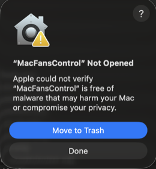
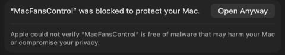

  

  <strong>Native macOS fan control for Apple Silicon and Intel</strong> 
  Monitor every temperature sensor. Set precise fan speeds. Reduce noise during light work, maximize cooling under heavy loads.

  
  
  
  
  

  

  Built with Swift and SwiftUI. No Electron, no web views, no bloat.

---

## Download

Download the latest version from [**Releases**](https://github.com/beyondthecode-bc/MacFansControl/releases/latest). Unzip, move `MacFansControl.app` to Applications, and launch.

The app includes built-in auto-updates via [Sparkle](https://sparkle-project.org) — you'll be notified when new versions are available.

## Features

**Temperature Monitoring**
- Full sensor suite: CPU cores, GPU, SSD, battery, power regulators, ambient
- Real-time readings in the menubar with customizable display format
- Pin favorite sensors or category averages to the menubar

**Fan Control**
- Set exact RPM for any fan via slider
- Link fans to temperature sensors with custom curves (min/max temp-to-RPM mapping)
- Visual multi-point fan curve editor
- One-click return to automatic (system-controlled) mode

**Safety**
- Watchdog process returns fans to safe speeds if the app crashes or is force-quit
- Sleep/wake restoration re-applies your settings automatically
- Fans always return to automatic on clean quit

**Presets**
- Save and switch between named fan configurations
- Set a default preset that auto-applies on launch

**Preferences**
- Tabbed settings window: General, Sensors, Fans, Presets, Menu Bar, About, Disclaimer
- Drag-reorder favorites, hide sensors, copy Markdown snapshots
- Favorite category averages (CPU avg, GPU avg) for cleaner monitoring
- Launch at login, dock icon toggle, temperature unit (C/F)
- Per-app language override

**Localization**
- 8 languages: English, French, German, Spanish, Japanese, Korean, Portuguese (Brazilian), Chinese (Simplified)
- Community translations welcome via pull requests

## Supported Chips

| Generation | Variants |
|---|---|
| **M1** | M1, M1 Pro, M1 Max, M1 Ultra |
| **M2** | M2, M2 Pro, M2 Max, M2 Ultra |
| **M3** | M3, M3 Pro, M3 Max, M3 Ultra |
| **M4** | M4, M4 Pro, M4 Max, M4 Ultra |
| **M5** | M5, M5 Pro, M5 Max, M5 Ultra |
| **Intel** | Coffee Lake, Whiskey Lake, Ice Lake (Mac mini, iMac, and generic Intel Macs) |

## Requirements

| | Requirement |
|---|---|
| **OS** | macOS 14.0 (Sonoma) or later |
| **Chip** | Any Apple Silicon or supported Intel Mac |

## Getting Started

### 1. Install the app

Download and move `MacFansControl.app` to your Applications folder.

### 2. Install the Background Helper

On first launch, open **Preferences > General** and click **Install Helper**.

The background helper allows MacFansControl to change fan speeds without asking for your password every time. Since the app is not yet signed with an Apple Developer certificate (coming soon), macOS will prompt for your administrator password during installation. This is a one-time setup — once installed, fan control works silently in the background.

> **Why is this needed?** Changing fan speeds requires elevated (root) privileges. The helper runs as a small background service that handles these privileged operations securely via XPC, so the main app never needs root access itself.

### 3. Use the menubar

MacFansControl lives in your menubar. Click the temperature readout to see sensors, fans, presets, and quick access to preferences.

## Translations

This repository hosts the translation files for MacFansControl. You can help translate the app into your language or improve existing translations.

### How to contribute

1. Fork this repository
2. Edit an existing file in the [`languages/`](languages/) folder, or create a new one by copying `English.xml`
3. Translate the string values (the text between `<string>` tags) — **do not** change the `id` attributes
4. Keep any `%1`, `%2`, `%@`, `%d` placeholders in place — the app needs them
5. Submit a pull request

### Current languages

| Language | File | Status |
|---|---|---|
| English | [`English.xml`](languages/English.xml) | Complete |
| French | [`French.xml`](languages/French.xml) | Complete |
| German | [`German.xml`](languages/German.xml) | Complete |
| Spanish | [`Spanish.xml`](languages/Spanish.xml) | Complete |
| Japanese | [`Japanese.xml`](languages/Japanese.xml) | Complete |
| Korean | [`Korean.xml`](languages/Korean.xml) | Complete |
| Portuguese (BR) | [`Portuguese_Brazilian.xml`](languages/Portuguese_Brazilian.xml) | Complete |
| Chinese (Simplified) | [`Chinese_Simplified.xml`](languages/Chinese_Simplified.xml) | Complete |

Want to add a new language? Copy `English.xml`, rename it to your language name, translate the values, and submit a PR.

## Bug Reports & Feature Requests

Please use [Issues](../../issues) to report bugs or request features.

## Support the Project

If MacFansControl saves you from fan noise or thermal throttling, consider supporting development:

  
  &nbsp;&nbsp;&nbsp;
  

---

## Troubleshooting

### "MacFansControl" Not Opened — Gatekeeper warning

MacFansControl is not yet notarized with Apple (Apple Developer certificate coming soon). On first launch you may see this dialog:

  

**To fix this:**

1. Click **Done** to dismiss the dialog
2. Open **System Settings > Privacy & Security**
3. Scroll down — you'll see a message that MacFansControl was blocked
4. Click **Open Anyway**

  

This only needs to be done once. After that, the app will open normally.

### Password prompt every time I change fan speed

You need to install the background helper. Go to **Preferences > General** and click **Install Helper**. The helper runs as a privileged background service so you won't be asked for your password on every fan speed change.

Since the app doesn't have an Apple Developer certificate yet, macOS will ask for your administrator password once during helper installation. This is expected and safe — the helper is a small daemon that only handles fan speed writes via the SMC interface.

### The app doesn't appear after launching

MacFansControl is a **menubar app** — it doesn't open a window on launch. Look for the temperature readout in your menubar (top-right area of the screen). If you don't see it, it may be hidden behind the notch on newer MacBooks — try closing other menubar apps to make room.

### Fans show 0 RPM

This usually means the background helper isn't installed or isn't running. Go to **Preferences > General** — if the helper status shows "not installed", click **Install Helper**. If it shows installed but fans still read 0 RPM, try clicking **Reinstall Helper**.
