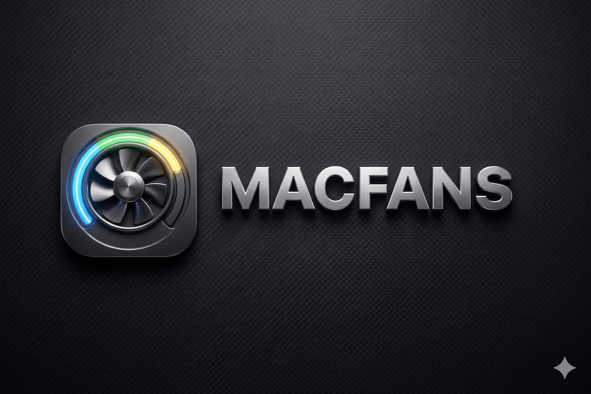
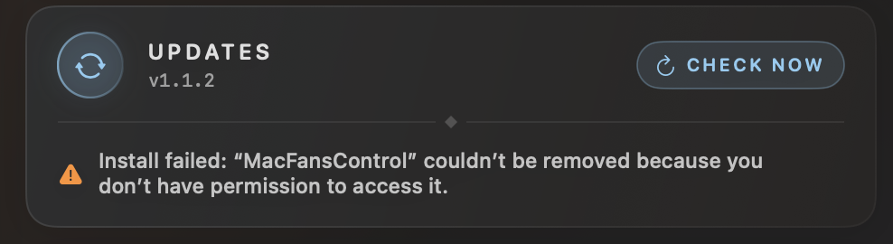

<p align="center">
  
</p>

<p align="center">
  <strong>Native macOS fan control for Apple Silicon</strong><br>
  Monitor every temperature sensor. Set precise fan speeds. Reduce noise during light work, maximize cooling under heavy loads.
</p>

<p align="center">
  <a href="https://github.com/beyondthecode-bc/MacFansControl/releases/latest"></a>
  <a href="https://github.com/beyondthecode-bc/MacFansControl/blob/master/LICENSE"></a>
  <a href="https://github.com/beyondthecode-bc/MacFansControl/actions"></a>
  
  
  
  <a href="https://github.com/beyondthecode-bc/MacFansControl/stargazers"></a>
  <a href="https://www.virustotal.com/gui/file/2318a60d6f0340de317d39e6f6e5e75372e049fe9d91e5751b5681ad4a743aab"></a>
</p>

<p align="center">
  <a href="https://github.com/sponsors/beyondthecode-bc"></a>
</p>

<p align="center">
  Built with Swift and SwiftUI. No Electron, no web views, no bloat.
</p>

---

## Features

**Temperature Monitoring**
- Full sensor suite: CPU cores, GPU, SSD, battery, power regulators, ambient
- Real-time readings in the menubar with customizable display format
- Pin favorite sensors to the menubar for at-a-glance monitoring

**Fan Control**
- Set exact RPM for any fan via slider
- Link fans to temperature sensors with custom curves (min/max temp-to-RPM mapping)
- Visual multi-point fan curve editor
- One-click return to automatic (system-controlled) mode

**Safety**
- Watchdog process returns fans to safe speeds if the app crashes or is force-quit
- Sleep/wake restoration re-applies your settings automatically
- Fans always return to automatic on clean quit

**Presets**
- Save and switch between named fan configurations
- Set a default preset that auto-applies on launch

**Preferences**
- Tabbed settings window: General, Sensors, Fans, Presets, Menu Bar, About, Disclaimer
- Drag-reorder favorites, hide sensors, copy Markdown snapshots
- Favorite category averages (CPU avg, GPU avg) for cleaner menubar monitoring
- Launch at login, dock icon toggle, temperature unit (C/F)
- Per-app language override with 8 supported languages

**Localization**
- 8 languages: English, French, German, Spanish, Japanese, Korean, Portuguese, Chinese (Simplified)
- RTL layout support verified
- CI-validated string catalog — no missing translations ship

## Requirements

| | Requirement |
|---|---|
| **OS** | macOS 14.0 (Sonoma) or later |
| **Chip** | Apple Silicon & Intel (see supported chips below) |

### Supported Chips

| Generation | Variants |
|---|---|
| **M1** | M1, M1 Pro, M1 Max, M1 Ultra |
| **M2** | M2, M2 Pro, M2 Max, M2 Ultra |
| **M3** | M3, M3 Pro, M3 Max, M3 Ultra |
| **M4** | M4, M4 Pro, M4 Max, M4 Ultra |
| **M5** | M5, M5 Pro, M5 Max, M5 Ultra |
| **Intel** | Coffee Lake, Whiskey Lake, Ice Lake (Mac mini, iMac, and generic Intel Macs) |

## Install

### Download

Download the latest `.zip` from [**Releases**](https://github.com/beyondthecode-bc/MacFansControl/releases/latest). Unzip, move `MacFansControl.app` to Applications, and launch. The app includes built-in auto-updates via the **About** pane (Settings → About → Check Now).

> **Note**: The app is not notarized yet (requires Apple Developer Program). On first launch, right-click the app and select **Open** to bypass Gatekeeper.

### Build from Source

```bash
git clone https://github.com/beyondthecode-bc/MacFansControl.git
cd MacFansControl
open MacFansControl.xcodeproj
```

Select the **MacFansControl** scheme, build and run (Cmd+R). The app appears in your menubar. Install the privileged helper from General preferences for password-free fan control.

## Architecture

```
MacFansControl/          Main app (SwiftUI menubar + preferences)
MacFansControlHelper/    Privileged XPC helper daemon (SMC writes)
MacFansControlCLI/       CLI fallback for fan control via osascript
MacFansControlWatchdog/  Safety process (returns fans to auto on crash)
Shared/                  SMC C bridge (IOKit), shared models
```

### Tech Stack

| Layer | Technology |
|---|---|
| **Language** | Swift 6.1 |
| **UI** | SwiftUI + AppKit bridge |
| **Hardware** | IOKit / AppleSMC via C bridge |
| **Privilege** | XPC + SMAppService (macOS 13+) |
| **Updates** | GitHub Releases API (built-in updater) |
| **Build** | Xcode 16+ / XcodeGen |
| **CI** | GitHub Actions |
| **Localization** | Xcode String Catalogs (.xcstrings) |

## Contributing

See [CONTRIBUTING.md](CONTRIBUTING.md) for translation guidelines and PR workflow.

Contributions welcome:
- Translation refinements from native speakers
- New language additions
- Bug reports and feature requests via [Issues](../../issues)

## Support the Project

If MacFansControl saves you from fan noise or thermal throttling, consider supporting development:

<p align="center">
  <a href="https://github.com/sponsors/beyondthecode-bc">
    
  </a>
  &nbsp;&nbsp;&nbsp;
  <a href="https://www.buymeacoffee.com/BEYONDTHECODE">
    
  </a>
</p>

## Troubleshooting

### Installing an update prompts for administrator credentials

When you click **Install Now** in the About pane, macOS will ask for your administrator password. This is expected — the app needs elevated permissions to replace itself in the `/Applications` folder.

> **Use an account with administrator rights** (most personal Mac accounts have this by default). If you are on a managed/work Mac with a standard account, ask your IT admin or install manually by downloading the zip from the [Releases page](https://github.com/beyondthecode-bc/MacFansControl/releases/latest).

If you were on **v1.1.2 or earlier** you may have seen this error instead of a password prompt:

<p align="center">
  
</p>

This is fixed in **v1.1.3** — update by downloading the latest zip manually from [Releases](https://github.com/beyondthecode-bc/MacFansControl/releases/latest).

---

### Fan control doesn't work after installing the helper

Make sure you restart the app after the helper is installed. If fan control still doesn't respond, open **System Settings → General → Login Items & Extensions** and confirm the MacFansControl helper is listed under **Allow in the Background**.

---

### macOS blocks the app on first launch

The app is not notarized (requires Apple Developer Program membership). On first launch, right-click `MacFansControl.app` and choose **Open**, then confirm in the dialog. You only need to do this once.

---

## License

[MIT](LICENSE) — free to use, modify, and distribute.
